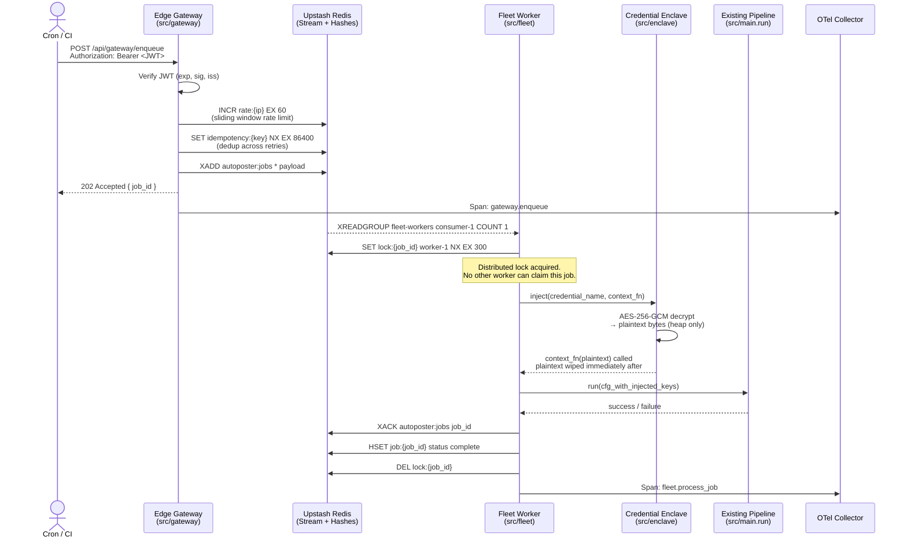

# Master Execution Map — NS-Project Auto-Poster MVP
## ADR-001: Distributed, Async-Native Architecture for 1M+ DAU

**Status:** Accepted  
**Date:** 2025-07-15  
**Authors:** Principal Systems Architect

---

## 1. Context

The system must reliably publish AI-generated social media posts at scale, across
multiple platforms, with BYOK (Bring Your Own Keys) credential isolation, zero
duplicate posts, and sub-second gateway response times even under 10× traffic spikes.
The existing codebase (`MasterMind-project-main/`) is a proven, synchronous Python
pipeline. The distributed layer is additive — it wraps the pipeline behind a resilient
async gateway without rewriting proven internals.

---

## 2. Architecture Overview

```
┌──────────────────────────────────────────────────────────────────────┐
│                         EXTERNAL CLIENTS                             │
│              (Cron trigger / API call / CI schedule)                 │
└──────────────────────────┬───────────────────────────────────────────┘
                           │ HTTPS
                           ▼
┌─────────────────────── EDGE GATEWAY ────────────────────────────────┐
│  src/gateway/                                                        │
│  ┌────────────────────────────────────────────────────────────────┐ │
│  │  POST /api/gateway/enqueue                                      │ │
│  │  1. JWT verification (HS256, rotating secret, 15-min exp)      │ │
│  │  2. Idempotency key extraction from header                     │ │
│  │  3. Rate-limit check (Upstash Redis INCR sliding window)       │ │
│  │  4. Enqueue job payload → Upstash Redis Stream (XADD)          │ │
│  │  5. Return 202 Accepted + job_id immediately                   │ │
│  │     (no serverless timeout risk — O(1) latency)                │ │
│  └────────────────────────────────────────────────────────────────┘ │
│                                                                      │
│  GET /api/gateway/status/{job_id}                                    │
│  ┌────────────────────────────────────────────────────────────────┐ │
│  │  1. JWT verification                                            │ │
│  │  2. Redis HGET job:{job_id} → status, result, error            │ │
│  └────────────────────────────────────────────────────────────────┘ │
└──────────────────────────┬───────────────────────────────────────────┘
                           │ XADD autoposter:jobs (Redis Stream)
                           ▼
┌─────────────────────── EVENT BROKER ───────────────────────────────┐
│  Upstash Redis Streams                                               │
│                                                                      │
│  Stream: autoposter:jobs                                             │
│  ┌─────────────────────────────────────────────────────────────┐   │
│  │  Consumer Group: fleet-workers                               │   │
│  │  Retention: ACK-based (XACK removes from PEL)               │   │
│  │  Dead Letter: autoposter:dlq  (after 3 delivery failures)   │   │
│  │  Zero-loss guarantee: XREADGROUP NOACK=false, explicit XACK  │   │
│  └─────────────────────────────────────────────────────────────┘   │
│                                                                      │
│  Hash: job:{job_id}   (status, result, created_at, attempts)        │
│  Set:  idempotency:{idempotency_key}  (TTL 24h, prevents re-runs)  │
└──────────────────────────┬───────────────────────────────────────────┘
                           │ XREADGROUP
                           ▼
┌─────────────────────── PROCESSING FLEET ───────────────────────────┐
│  src/fleet/                                                          │
│                                                                      │
│  ┌──────────────────────────────────────────────────────────────┐  │
│  │  Worker.process_message(msg)                                  │  │
│  │                                                               │  │
│  │  1. Acquire distributed lock:                                 │  │
│  │     SET lock:{job_id} worker_id NX EX 300                    │  │
│  │     → NX guarantees only ONE worker runs a job_id            │  │
│  │                                                               │  │
│  │  2. Check idempotency key in Redis SET                        │  │
│  │     → duplicate delivery → XACK + skip                       │  │
│  │                                                               │  │
│  │  3. Inject credentials JIT from Credential Enclave            │  │
│  │     (keys decrypted in-memory, never logged/serialised)       │  │
│  │                                                               │  │
│  │  4. Call existing src/main.run() pipeline                     │  │
│  │     (topic→image→write→quality_gate→publish→sheets)          │  │
│  │                                                               │  │
│  │  5. XACK job on success → mark job:{job_id} complete         │  │
│  │     On failure → increment attempt counter                   │  │
│  │       < 3 → XCLAIM back to group (retry)                     │  │
│  │       ≥ 3 → XADD autoposter:dlq + mark job failed           │  │
│  │                                                               │  │
│  │  6. Release distributed lock (DEL lock:{job_id})             │  │
│  └──────────────────────────────────────────────────────────────┘  │
└──────────────────────────┬───────────────────────────────────────────┘
                           │ JIT key fetch (never at rest in worker state)
                           ▼
┌─────────────────────── CREDENTIAL ENCLAVE ─────────────────────────┐
│  src/enclave/                                                        │
│                                                                      │
│  ┌──────────────────────────────────────────────────────────────┐  │
│  │  CredentialStore (AES-256-GCM at rest)                        │  │
│  │  • Encrypted blob stored in env var / Vercel env              │  │
│  │  • Key: ENCLAVE_MASTER_KEY (32-byte, env-injected)            │  │
│  │  • Nonce: random 12-byte per credential, stored with cipher   │  │
│  │  • Auth tag: 16-byte GCM tag validates integrity              │  │
│  │                                                               │  │
│  │  LifecycleManager.inject(context)                             │  │
│  │  • Decrypt credential → plain bytes in local variable         │  │
│  │  • Call `context` callable with the plain credential          │  │
│  │  • Plain bytes wiped from Python heap via ctypes.memset       │  │
│  │  • NEVER returned, serialised, logged, or put in Redis        │  │
│  └──────────────────────────────────────────────────────────────┘  │
└────────────────────────────────────────────────────────────────────┘

┌─────────────────────── OBSERVABILITY ──────────────────────────────┐
│  src/observability/                                                  │
│  • OpenTelemetry SDK: traces for every gateway request + worker job │
│  • RedactingSpanProcessor: strips any attribute matching a          │
│    sensitive-key pattern before export (key, secret, token, etc.)  │
│  • OTLP exporter to Grafana Cloud / Honeycomb / Jaeger              │
└────────────────────────────────────────────────────────────────────┘
```

---

## 3. Mermaid Sequence Diagram — Happy Path



---

## 4. Failure Mitigation Matrix

| Failure Scenario | Detection | Mitigation | Recovery |
|---|---|---|---|
| **10× traffic spike** | Rate-limit counter hits threshold | Gateway returns 429 + Retry-After header. Redis O(1) enqueue is the only path — pipeline is never called synchronously. | Auto-recovers when window resets. Queue absorbs burst; workers drain at their own pace. |
| **Serverless timeout** | Gateway is deliberately thin: enqueue is O(1), never calls pipeline | 202 returned before any AI call. Pipeline runs in background worker only. | N/A — timeouts are architecturally impossible on the gateway path. |
| **OpenAI / Anthropic API down** | `with_retry()` tenacity decorator on every provider call | Exponential backoff (2s→4s→8s, max 3 attempts). Image fallback chain (OpenAI→Stability→text-only). Quality gate circuit breaker skips platform after max_attempts. | Notifier alert sent. Job marked `error`. DLQ entry for operator review. |
| **Redis unavailable** | Redis client raises on XADD / XREADGROUP | Gateway: connection error → 503. Worker: pre-flight health check aborts job, does not XACK → message stays in PEL for XCLAIM retry by another consumer. | Redis recovers → PEL replays pending messages automatically. No lost jobs. |
| **Duplicate delivery** (at-least-once Redis Streams) | Idempotency key in Redis SET (NX, 24h TTL) | Worker checks idempotency key before acquiring lock. If already processed → XACK, skip. | Transparent — no duplicate posts, no error. |
| **Worker crash mid-job** | Lock TTL expires (300s). PEL timeout. | Another worker claims the message via XCLAIM after idle timeout. Lock NX prevents concurrent re-entry. | Job is retried by new worker. Idempotency key prevents double-post if first worker actually completed. |
| **Database (Sheets) outage** | `sheets_logger` swallows errors, logs warning | Pipeline continues; `SheetsMemoryRepository` falls back to `InMemoryMemoryRepository`. Feedback loop degrades gracefully. | Sheets recovery → normal logging resumes. In-memory state is lost on restart (acceptable for feedback loop — not for audit log). |
| **Credential decryption failure** | `AuthenticationError` raised in Enclave | Job is immediately failed (not retried) — a corrupt key won't self-heal with retries. Notifier alert sent. | Operator must rotate `ENCLAVE_MASTER_KEY` and re-encrypt credentials. |
| **AI content quality gate failure** | Circuit breaker in `produce_post()` after max_attempts | Platform is skipped, alert sent. Other platforms in the run are unaffected (per-platform fault isolation). | Next scheduled run starts fresh. No cascading failure. |

---

## 5. ADR — Key Architectural Decisions

### ADR-001-A: Redis Streams over Celery/SQS/RabbitMQ
**Decision:** Upstash Redis Streams (XADD/XREADGROUP) for the job queue.  
**Rationale:** Zero infrastructure provisioning on Vercel serverless. Upstash is HTTP-native,
works in edge/serverless functions without TCP connection pools. Consumer Groups give
exactly-once-delivery semantics with explicit XACK. PEL + XCLAIM provides built-in
retry without a separate scheduler. Alternative (Celery) requires a long-lived broker
(RabbitMQ/Redis) and a separate worker process that cannot run as a Vercel function.

### ADR-001-B: AES-256-GCM for credential storage, not envelope encryption
**Decision:** Single-layer AES-256-GCM with per-credential random nonces.  
**Rationale:** The GCM auth tag gives both confidentiality and integrity. The master key
(`ENCLAVE_MASTER_KEY`) is a Vercel environment secret — it never touches the codebase
or Redis. The encrypted blob can be stored anywhere (env var, config) without risk. KMS
envelope encryption (AWS KMS, GCP KMS) would be the next evolution but adds a
latency-bearing network call on every job; AES-256-GCM in-process is sufficient for MVP
scale and the threat model (credential-at-rest exposure, not in-transit).

### ADR-001-C: Distributed lock via Redis NX + TTL over ZooKeeper / etcd
**Decision:** `SET lock:{job_id} {worker_id} NX EX 300` for idempotency lock.  
**Rationale:** Sufficient for the post-once guarantee. ZooKeeper/etcd would be
over-engineered for a system where the critical section is a single pipeline run per
job_id. Redis NX is atomic. Lock TTL (300s) covers worst-case pipeline execution time.
The worker stores its own `worker_id` as the lock value to implement safe release
(check-then-delete via Lua script to prevent releasing another worker's lock).

### ADR-001-D: Keep existing src/main.py pipeline, don't rewrite it
**Decision:** The new distributed layer is a thin async harness *around* the existing
synchronous pipeline.  
**Rationale:** The existing code is well-tested (15+ test files, smoke tests, circuit
breakers, fallback chains). Rewriting it would introduce regression risk with no
functional benefit. The `LifecycleManager`'s background loop already provides the
sync/async boundary. The fleet worker calls `main.run()` after credential injection —
that is the only integration point.

### ADR-001-E: Redacting span processor for zero-leak observability
**Decision:** A custom `RedactingSpanProcessor` wraps the OTLP exporter.  
**Rationale:** Standard OpenTelemetry auto-instrumentation will capture HTTP headers,
environment variables, and function arguments in span attributes. Any attribute whose
key matches a sensitive pattern (key, secret, token, password, credential, auth) must be
redacted before export. This is a processor-level guarantee — it fires regardless of
which instrumentation library emitted the span.
