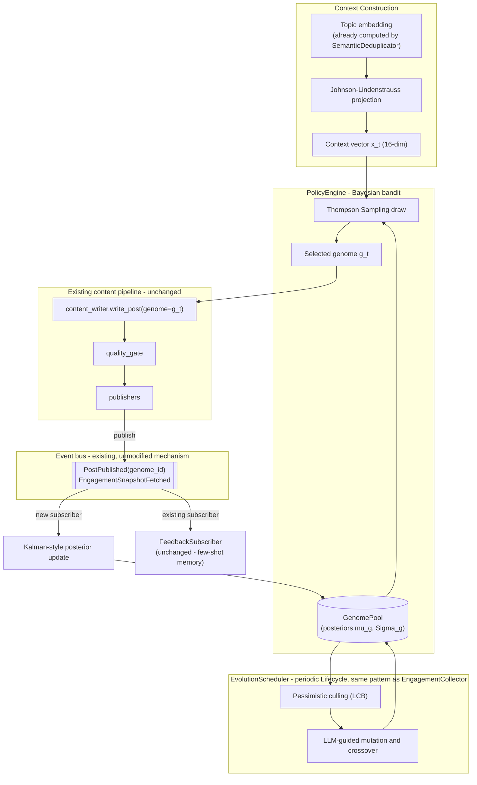

# OUROBOROS

### An Event-Sourced, Bayesian-Evolutionary Policy Engine for Autopoietic Content Strategy

**Status:** Architectural proposal (not yet implemented). Written against the codebase as of the semantic-dedup + self-learning feedback loop integration phase (`src/main.py`, `src/runtime.py`, `src/event_bus.py`, `src/feedback_loop.py`, `src/semantic_dedup.py`, `src/content_writer.py`).

---

## Abstract

Every subsystem built so far — the semantic duplicate guard, the event bus, the self-learning feedback loop — answers questions about **what already happened**: was this a duplicate, did this post perform well, what should the next prompt imitate. They are, collectively, an extremely well-engineered *memory*. None of them yet answer the question a genuinely autonomous system must answer: **which strategy should I run next, given genuine uncertainty about which strategy is best, and the knowledge that "best" is a moving target?**

Ouroboros closes that gap. It reframes "prompt engineering" as a **contextual, non-stationary, delayed-reward bandit problem** over a **population of competing content strategies** ("genomes"), solved online via **Thompson Sampling over a Bayesian linear model**, with the population itself evolving under **replicator dynamics** and **LLM-guided mutation** — a mechanism with direct lineage to DeepMind's FunSearch (Romera-Paredes et al., *Nature*, 2023). The event-sourced architecture already in this codebase is not a supporting actor here — it *is* the training substrate. `EventStore` is the trajectory buffer. `EngagementSnapshotFetched` is the reward signal. `PostPublished` is the action log. Ouroboros adds almost no new I/O; it adds a *second subscriber* to signals that already flow past every existing consumer, and a policy layer that decides, closes the loop, and — this is the part that earns the name — occasionally decides to rewrite its own decision-making apparatus.

The name is deliberate: a system that consumes the record of its own past actions to generate the actions that produce the next record. A closed causal loop, with a snake eating its own tail.

---

## 0. The Conceptual Leap: From Pipeline to Organism

Every component built in this project so far, including the feedback loop, is a **pipeline with memory**: topic → dedup → write → gate → publish → log → (later) recall. Even the "self-learning" feedback loop is, mathematically, a fixed algorithm (`write_post` with a fixed prompt template) that is handed better *inputs* (few-shot exemplars) over time. The algorithm never changes. Only its inputs do.

Ouroboros changes the *algorithm*, not just its inputs. It maintains a **population of competing algorithms** (genomes — structured, versioned content strategies), each with its own live, continuously-updated belief about its own effectiveness, and it periodically **retires the losers and breeds new challengers from the winners**. The system doesn't converge to *a* good prompt. It maintains an ecosystem that is always searching, always slightly unstable, and — under the guardrails in §6 — provably incapable of converging to something bad.

This is the difference between a thermostat (a fixed control law reacting to a fixed setpoint) and natural selection (a *process that designs control laws*). We are building the second one, in miniature, with hard safety rails.

---

## 1. Formal Problem Statement

At each content-generation decision (one per platform, per run — see `main.py`'s platform loop), the system observes a **context** `x_t ∈ ℝᵏ` and must choose an **action**: which genome `g ∈ G_t` (the *live population* at time `t`) to generate with. Some (long, random, platform-dependent) delay later, it observes a **reward** `r_t ∈ [0, 1]` — the engagement rate of the resulting post, *conditioned on the post having survived `quality_gate`* (§6 makes this conditioning load-bearing, not incidental).

This is a **contextual, non-stationary, delayed-feedback bandit** — a well-studied but nontrivial corner of online learning:

- **Contextual** because the right genome for a LinkedIn thought-leadership post is not the right genome for a Twitter hot take — the optimal action is a function of `x_t`, not a single global constant.
- **Non-stationary** because platform algorithms, audience taste, and trending topics drift — the reward function `r(x, g)` is not fixed over calendar time (Raj & Kalyani, 2017, *"Taming Non-stationary Bandits: A Bayesian Approach"*).
- **Delayed-feedback** because you don't know if a post worked until hours or days after you chose the strategy that produced it (Joulani, György & Szepesvári, 2013, *"Online Learning under Delayed Feedback"*, ICML).
- **Adversarial in the loose sense** that the "opponent" — the platform's ranking algorithm and the audience's shifting attention — is not a passive noise process but an adaptive, partially-observed function nobody on this team controls.

The classical multi-armed bandit lower bound (Lai & Robbins, 1985) tells us that *no* strategy can avoid some minimum regret while learning; the honest engineering goal is not "zero mistakes" but **provably sublinear regret** — the system's average per-decision loss relative to an oracle that always knew the best genome vanishes as data accumulates. Everything in §2 is in service of that one guarantee.

---

## 2. Theoretical Foundations

### 2.1 The Decision Variable: Content Genomes

A genome is a small, structured, *content-addressed* object — its own ID is the SHA-256 of its canonical field encoding, exactly like a Git blob or a Merkle tree node. Two genomes with identical fields are, by construction, the same genome; this makes deduplication of the population itself free and gives every genome a stable identity across the evolutionary process without a central ID allocator.

```python
# Proposed interface — Phase 2, not yet implemented.
class Genome(BaseModel):
    model_config = ConfigDict(frozen=True)

    genome_id: str                      # sha256 of the canonical encoding below
    parent_ids: tuple[str, ...] = ()    # empty for a "founder" genome
    generation: int = 0

    hook_style: Literal["question", "statistic", "bold_claim", "story", "controversy"]
    structural_template: str            # e.g. "hook -> insight -> cta"
    temperature: float = Field(ge=0.0, le=1.5)
    hashtag_density: float = Field(ge=0.0, le=1.0)
    exemplar_weighting: Literal["recency", "performance", "uniform"]
```

This is the action space `G`. The question "which genome should I use right now" is the bandit's action-selection problem.

### 2.2 Context Construction, and the Escape from the Curse of Dimensionality

The obvious context vector is the topic's semantic embedding — which `SemanticDeduplicator.check()` **already computes**, for an entirely different purpose (novelty detection). This is the first piece of architectural elegance worth pausing on: *the same 384-dimensional representation that answers "is this topic new" also answers "how will this topic perform,"* because both questions are functions of where the topic sits on the same latent semantic manifold. Reusing it costs nothing — no second embedding call, no second model load.

But 384 raw dimensions is a trap. A poster publishing a few times a day accumulates, realistically, dozens to low hundreds of reward observations per quarter. Fitting a 384-parameter linear model on a few hundred points is a catastrophically underdetermined regression — the posterior would be almost entirely prior, and Thompson Sampling would degenerate into near-random exploration forever.

The fix is not heuristic — it's the **Johnson–Lindenstrauss lemma** (Johnson & Lindenstrauss, 1984): for any `n` points in `ℝᵃ` and `ε > 0`, a random linear projection into `ℝᵏ` with `k = O(log n / ε²)` preserves all pairwise distances within a factor of `(1 ± ε)`, **independent of the original dimension `d`**. A single fixed random matrix `R ∈ ℝ^{k×d}` — no training, no PCA fit, O(dk) to apply — compresses the 384-dim topic embedding down to `k ≈ 8` dimensions while provably preserving the geometry that made it useful in the first place.

The final context vector, `x_t ∈ ℝ¹⁶`, concatenates:

- `R · embedding(topic)` — 8 dims, JL-compressed semantic content
- platform one-hot — 3 dims
- time-of-day, cyclically encoded (`sin`, `cos` of the hour-of-day angle) — 2 dims
- day-of-week, cyclically encoded — 2 dims
- an exponentially-weighted moving average of recent reward — 1 dim

Sixteen dimensions is small enough that a linear-Gaussian posterior is *well-determined* by the data volume this application actually has.

### 2.3 Thompson Sampling over a Bayesian Linear Bandit

Per genome `g`, maintain a Bayesian linear model of reward: `r = xᵗβ_g + ε`, `ε ~ N(0, σ²)`, with a Gaussian posterior `β_g | data ~ N(μ_g, Σ_g)`. At decision time, for every live genome, **sample** (don't just estimate) a coefficient vector from its current belief, predict the reward under that sample, and act greedily on the sample:

```
for g in live_population:
    β̃_g  ~ N(μ_g, Σ_g)          # sample a belief
    r̃_g  = x_tᵗ β̃_g              # predicted reward under that belief
a_t = argmax_g r̃_g               # act as if the sample were true
```

This is Thompson Sampling (Thompson, 1933; formalized for linear contextual bandits by Agrawal & Goyal, 2013). Its elegance is that **exploration is not a separate mechanism you bolt on** (no ε-greedy, no explicit UCB bonus term) — it falls directly out of posterior uncertainty. A genome with few observations has a wide `Σ_g`, so its sampled `β̃_g` is highly variable, occasionally sampling optimistically high and winning the argmax even with a mediocre point estimate. As evidence accumulates, `Σ_g` shrinks, samples cluster near `μ_g`, and the genome's true quality dominates. **Cold start requires no special-casing**: with zero data, every genome's prior is identical, so the argmax over samples is uniform-random — pure exploration emerges from the math, not from an if-statement.

Agrawal & Goyal (2013) and the tighter analysis of Abeille & Lazaric (2017) show this achieves expected cumulative regret of `Õ(k√T)` to `Õ(k^{3/2}√T)` over `T` rounds (the `Õ` hides logarithmic factors) — **sublinear in T**, meaning the system's *average* per-decision loss relative to an oracle that always knew the best genome provably vanishes as it accumulates data. That is the formal content behind "the system gets smarter."

### 2.4 The Kalman Filter Isomorphism

Here is the first piece of mathematical beauty this design surfaces rather than hides.

The recursive (sequential) Bayesian linear regression update — the equation that turns a new `(xᵢ, rᵢ)` observation into an updated posterior — is:

```
Σ_new⁻¹ = Σ_old⁻¹ + (1/σ²) xᵢ xᵢᵗ
μ_new   = Σ_new · ( Σ_old⁻¹ μ_old + (1/σ²) xᵢ rᵢ )
```

This is *not analogous to* the Kalman filter measurement-update equation — it **is** the Kalman filter measurement-update equation, with `xᵢᵗ` as the observation matrix `H`, `σ²` as the measurement noise `R`, and the genome's coefficient vector `β_g` playing the role of the hidden state being estimated. Two literatures — Bayesian statistics and control theory — independently derived the identical recursion because they are solving the identical problem: fusing a noisy new measurement into an existing Gaussian belief. Every posterior update `FeedbackSubscriber`'s sibling subscriber performs is, quietly, a one-step Kalman filter.

### 2.5 Non-Stationarity: Two Classical Devices, One Purpose

A static posterior converges — `Σ_g` shrinks monotonically toward zero as data accumulates, which is *wrong* for a genome operating in a drifting reward landscape (yesterday's high-performing hook style may be exhausted this week). Two classical, closely related devices reintroduce forgetting:

1. **Exponential forgetting** — multiply the precision matrix by `λ < 1` before each update: `Σ_g⁻¹ ← λ·Σ_g⁻¹ + (1/σ²) xxᵗ`. This is recursive least squares with a forgetting factor, standard in adaptive control.
2. **Process noise** — treat `β_g` itself as a slowly-evolving state, `β_{g,t+1} = β_{g,t} + w_t`, `w_t ~ N(0, Q)`, and inflate `Σ_g` by `Q` every step before the measurement update. This is a Kalman filter with a random-walk prior on the parameter.

Both inflate uncertainty over time, forcing the system to keep sampling occasionally even from genomes it once thought it understood well — the mathematical mechanism by which Ouroboros avoids ever fully "settling," which is exactly the property you want from a system operating against a moving target.

### 2.6 Delayed, Sparse, Gated Reward

The reward used to update a genome's posterior is not raw engagement — it's:

```
r_t = 1[quality_gate passed] · 1[published] · engagement_rate_t
```

If `content_writer.produce_post()` never returns a post (its circuit breaker trips after `max_attempts` quality-gate rejections), **no reward sample is ever generated for that decision** — an absence of data, not a zero. This matters and is discussed properly, as a load-bearing safety property, in §6.

### 2.7 Evolutionary Dynamics: The Replicator Equation, and Its Secret Identity

The population doesn't just get scored — it evolves. Let `p_g(t)` be genome `g`'s share of selection events and `f_g` its fitness (§2.9 defines this precisely). The continuous-time **replicator equation** (Taylor & Jonker, 1978), the founding equation of evolutionary game theory, describes how a population's composition shifts under selection:

```
dp_g/dt = p_g · ( f_g − f̄ ),     where f̄ = Σ_g p_g f_g
```

A genome's share grows exactly in proportion to how much its fitness exceeds the population average. This looks like biology. It is also, and this is the second piece of mathematical beauty here, **exactly the continuous-time limit of the Multiplicative Weights Update algorithm** (Arora, Hazan & Kale's MWU survey; the connection to evolutionary dynamics is well established in algorithmic game theory) — the canonical no-regret learning algorithm for repeated games. Evolutionary biology and online convex optimization independently arrived at the same dynamical system, because "which strategies proliferate under fitness-proportionate selection" and "which strategies a no-regret learner comes to favor against a repeated, unknown opponent" are the same question asked in two different centuries. Ouroboros's population dynamics are not a biology metaphor bolted onto a software system; they are a principled, convergent, no-regret learning algorithm that happens to have a beautiful biological reading.

### 2.8 LLM-Guided Mutation: Standing on FunSearch and ELM

Classical genetic algorithms mutate genomes with random field perturbation and crossover with random field-swapping between two parents. Ouroboros does that too — but its most interesting mutation operator is **the LLM itself**, given the two parent genomes, their fitness posteriors, and example outputs, and asked to propose a synthesis:

```
SYSTEM: You are a strategy-mutation engine for a social content system.
You will see two competing content genomes and their empirical performance
(posterior mean engagement rate, uncertainty, sample count). Propose ONE
new genome that plausibly combines or improves on their strengths. You
MUST NOT simply copy an existing genome. Output must conform exactly to
the Genome JSON schema below.

USER:
Genome A (fitness 0.041 ± 0.008, n=52): {hook_style: "bold_claim", ...}
Genome B (fitness 0.037 ± 0.021, n=11): {hook_style: "question", ...}
Propose Genome C.
```

The proposed genome is validated against the `Genome` pydantic schema before being admitted to the population; a malformed or schema-violating proposal is discarded and the mutation falls back to a plain statistical perturbation. This is not a novel idea invented for this project — it is a direct architectural descendant of DeepMind's **FunSearch** (Romera-Paredes et al., *Nature*, 2023), which used an LLM as an intelligent mutation operator inside an evolutionary loop scored by a fitness evaluator to discover genuinely new mathematical constructions (improving on the best known bounds for the cap set problem), and of **Evolution Through Large Models** (Lehman, Gordon, Jain, Ye, Yu & Stanley, 2022). The difference here is only the fitness function: where FunSearch's evaluator is a deterministic scoring program, Ouroboros's evaluator is *the live market* — real audience engagement, arriving asynchronously through the exact same event bus that already carries `EngagementSnapshotFetched`.

### 2.9 Asymmetric Confidence: Optimism to Explore, Pessimism to Kill

A subtlety worth making explicit, because getting it backwards is a real failure mode: the point estimate used to **select** an action (§2.3) and the point estimate used to **retire** a genome permanently must not be the same statistic.

Action selection wants **optimism under uncertainty** — Thompson Sampling's sampled `β̃_g` is, on average, generous to under-explored genomes, which is exactly what you want to keep exploring cheap options. But *culling* a genome from the population is effectively irreversible (its accumulated posterior is discarded), so that decision must be **pessimistic**: only retire `g` if its **lower confidence bound**

```
LCB_g = μ_gᵗ x̄ − z · √(x̄ᵗ Σ_g x̄)
```

falls below a floor *and* its sample count `n_g` exceeds a minimum — never cull for low sample count alone, since that is absence of exploration, not evidence of badness. This asymmetry mirrors the "pessimism principle" from offline reinforcement learning (e.g. Conservative Q-Learning, Kumar et al., 2020): be optimistic while you can still gather more evidence cheaply; be pessimistic the moment a decision is expensive to undo.

### 2.10 The Theoretical Ceiling

It's worth naming the tradition this design sits inside, honestly, without overclaiming membership in it. Schmidhuber's **Gödel machine** (2003) describes a fully self-referential agent that rewrites its own source code, but only after a formal proof search establishes that the rewrite is provably beneficial under a fixed utility function — a rigor this system does not attempt. Ouroboros substitutes *Bayesian evidence* for *formal proof*: a genome only survives and breeds because the data says so, with quantified uncertainty, not because a theorem says so. It is the pragmatic, statistically-grounded cousin of the Gödel machine, not the machine itself. Read even more broadly, a system that continuously produces and revises the very generative components (genomes) that constitute its own behavior, in response to signals from its environment, is doing something structurally close to what Maturana & Varela called **autopoiesis** (1980) — operationally self-producing, while remaining informationally open to the world that grades it.

---

## 3. System Architecture



New components, each following a pattern already established elsewhere in this codebase (named explicitly so the parallel is visible, not just asserted):

| New component | Mirrors existing pattern |
|---|---|
| `GenomeRepository` Protocol | `MemoryRepository` Protocol (`feedback_loop.py`) |
| `PolicyEngine` | `SemanticDeduplicator` — Protocol-injected strategies, fail-open on error |
| `EvolutionScheduler` | `EngagementCollector` — periodic `Lifecycle`, testable `evolve_once()` separated from the sleep loop exactly like `poll_once()` |
| `GenomeSelected`, `GenomeEvolved`, `GenomeQuarantined` events | `TopicDedupEvaluated`, `EmbeddingProviderDegraded` — plain `DomainEvent` subclasses published through the same bus |

Nothing here introduces a second event bus, a second background thread, or a second async bridge. That is the point.

---

## 4. Integration: Exactly Where This Touches Existing Code

**`event_bus.py`** — two additive, backward-compatible changes: `PostPublished` gains an optional `genome_id: str | None = None` field; a new `GenomeSelected(DomainEvent)` event is added. Existing construction call sites (all keyword-argument based) are unaffected.

**`runtime.py`** — `start_runtime()` constructs one more component, `PolicyEngine`, and one more `Lifecycle`, `EvolutionScheduler`, and appends them to the *existing* call: `manager.start(bus, collector, subscriber, evolution_scheduler)` — literally one more argument to a call that already exists. `AppRuntime` gains two methods that follow the *exact* existing pattern of every other sync-facade method:

```python
# Proposed additions to AppRuntime, following the existing _run() helper.
def select_genome_sync(self, context: npt.NDArray, *, timeout: float = 5.0) -> Genome:
    return self._run(self.policy_engine.select_genome(context), timeout=timeout)

def record_genome_outcome_sync(self, genome_id: str, context, reward: float, *, timeout=5.0) -> None:
    self._run(self.policy_engine.record_outcome(genome_id, context, reward), timeout=timeout)
```

No new background thread. No new event loop. The same `LifecycleManager` that already hosts the semantic dedup guard and the feedback loop absorbs this too.

**`main.py`** — inside the existing per-platform loop, immediately before the existing `produce_post(...)` call:

```python
context = build_context_vector(topic, platform, runtime)   # reuses semantic_dedup's embedding
genome = runtime.select_genome_sync(context)
post = produce_post(..., genome=genome)
...
result = get_publisher(platform)(post, image_url)
_notify_feedback_loop(runtime, platform, topic, post, image_url, result, genome_id=genome.genome_id)
```

Two new lines before the call that already exists, one new keyword argument on the call that already exists, one new keyword argument on the notification helper that already exists.

**`content_writer.py`** — `write_post`/`produce_post` gain an optional `genome: Genome | None = None` parameter. `_build_system_prompt()` gains one more optional clause compiling the genome's `hook_style`/`structural_template` into the system prompt, exactly alongside the existing few-shot exemplar clause. One genuine interface gap this surfaces: `providers.text.base.TextProvider.generate()` currently has no `temperature` parameter — a small, backward-compatible extension (`temperature: float | None = None`, forwarded by each concrete provider to its underlying SDK call) is needed to let a genome actually control sampling temperature, not just prompt wording.

**`feedback_loop.py`** — no changes. `PolicyEngine` subscribes to `EngagementSnapshotFetched` directly, in parallel with `FeedbackSubscriber`. Neither knows the other exists. This is the event bus's decoupling paying a second, unplanned-for dividend: **the same engagement signal simultaneously drives two unrelated learning mechanisms** — associative few-shot memory, and Bayesian policy optimization — with zero coupling between them, for free, because pub/sub was the right abstraction from the start.

---

## 5. One Full Lifecycle, Traced

1. `main.py`'s platform loop reaches `platform = "twitter"`. `SemanticDeduplicator.check(topic)` has already computed the topic's embedding as a side effect of the dedup check.
2. `build_context_vector` JL-projects that embedding, concatenates platform/time features, produces `x_t`.
3. `runtime.select_genome_sync(x_t)` draws `β̃_g ~ N(μ_g, Σ_g)` for every live genome, picks the argmax — say genome `g₄₇`, generation 3, `hook_style="bold_claim"`.
4. `produce_post(..., genome=g₄₇)` compiles `g₄₇`'s directives into the system prompt alongside the existing few-shot exemplars, and runs the *unmodified* quality-gate retry loop.
5. On success, `get_publisher("twitter")` posts it; `_notify_feedback_loop` publishes `PostPublished(genome_id="g47...", ...)`.
6. Hours later, `EngagementCollector` (unmodified) polls and publishes `EngagementSnapshotFetched`.
7. Two subscribers react independently: `FeedbackSubscriber` records a new few-shot exemplar (unmodified); `PolicyEngine` performs the Kalman-style update on `g₄₇`'s posterior.
8. On its own periodic cadence, `EvolutionScheduler.evolve_once()` computes every genome's `LCB`, retires any genome below the floor with sufficient sample count, and asks the LLM to propose a new genome from the two current fitness leaders. The proposal is schema-validated and, if valid, enters the population at generation 4.
9. The population is different tomorrow than it was today. Nothing about `main.py`'s control flow changed to make that true.

---

## 6. Guardrails: Why This Cannot Degenerate Into Engagement-Optimized Slop

This is the section a Distinguished Engineer would demand before approving anything in §§1–5, and it deserves to be treated as load-bearing design, not an afterthought.

- **`quality_gate` is a hard feasibility constraint, not a soft penalty.** A genome cannot buy a high reward by producing engaging-but-rejected content, because rejected content is never published and therefore never produces a reward *sample at all* — not a zero, an absence. Evolutionary pressure literally cannot select for what it never observes. Fitness is engagement *conditioned on* passing the exact same rule layer and AI editor already protecting this pipeline today.
- **Mutation is trust-region bounded.** Field perturbations are capped to small magnitudes per generation — the same principle behind Trust Region Policy Optimization (Schulman et al., 2015): bound how much a policy is allowed to change per update, to make runaway, destructive drift structurally impossible rather than merely unlikely.
- **A population diversity floor.** A fixed fraction of each generation is reserved for genuinely novel (not just mutated) genomes, preventing premature convergence to a local optimum — a floor on the mutation/exploration rate straight out of the classical genetic-algorithms literature.
- **The existing circuit breaker becomes a quarantine trigger.** `content_writer.produce_post()`'s circuit breaker already fires a `notifier.send_alert()` after `max_attempts` consecutive quality-gate rejections. Ouroboros's only addition at that exact call site is to also emit a `GenomeQuarantined` event — the `PolicyEngine` subscribes and immediately suspends that genome from selection, no waiting for the next evolution cycle.
- **LLM-guided mutation prompts contain post text, not raw external input.** The prompt-injection surface is narrower than with untrusted user input, but not zero — this is worth monitoring, not dismissing, if genome text is ever sourced from anything less trusted than this pipeline's own prior outputs.
- **Every guardrail above is itself observable.** Retirements, quarantines, and evolutions are `DomainEvent`s on the same durably-logged bus as everything else — the population's entire evolutionary history is queryable after the fact, not a black box.

---

## 7. Complexity & Performance

Per decision: one Thompson Sampling draw per live genome, each an `O(k²)` multivariate Gaussian sample (`k ≈ 16`) — trivial, sub-millisecond even for a population in the hundreds. Per reward observation: one Kalman-style update, `O(k²)` for the precision-matrix update, `O(k³)` if a fresh Cholesky/inverse is taken naively (avoidable via incremental rank-1 update formulas — the Sherman–Morrison identity applies directly to this exact update, turning the naive `O(k³)` into `O(k²)`). Evolution is `O(|population| log |population|)` for the LCB-based cull ranking, run at most a few times per week, dominated entirely by one or two LLM calls, not by any of the linear algebra above. None of this competes for latency with the LLM calls the pipeline already makes for content generation itself.

---

## 8. Honest Limitations & Minimum Viable Data Volume

This is not free lunch, and pretending otherwise would undercut everything rigorous above it.

- **Reward is genuinely sparse.** A poster publishing to three platforms once a day produces, at best, ~90 reward samples a month, split across a *growing* population of genomes. Expect the bandit to need **weeks to months** before its posterior confidence intervals are tight enough for evolution to meaningfully outperform manual curation. This is not a system to expect miracles from in week one.
- **The context features are a modeling choice, not a law of nature.** The 16-dimensional feature set in §2.2 is a reasonable starting point, not a proven-optimal one; expect to revisit it once real data volume exists to evaluate it against.
- **LLM-guided mutation quality is bounded by the mutating LLM's own judgment.** A weak text provider will propose weak genomes. This subsystem's ceiling is coupled to `cfg["text_provider"]`'s quality, same as everything else in this pipeline.
- **This is additive complexity that must earn its keep.** For a single-platform, low-volume poster, a hand-tuned prompt plus the existing few-shot feedback loop may simply be *good enough*, and Ouroboros's honest value proposition only clears that bar once posting volume and platform count grow enough for "which of several strategies works better" to be a question worth a formal answer.

---

## 9. Roadmap

This document is the design, not the build. A responsible implementation order:

1. `Genome`, `GenomeRepository` Protocol, `InMemoryGenomeRepository` — pure data model, fully unit-testable with fakes, zero dependency on anything below.
2. `BayesianLinearBandit` (the posterior + Thompson Sampling draw) — pure math, testable against synthetic reward data with known ground truth, no event bus involved yet.
3. `PolicyEngine` wired to the event bus as a second `EngagementSnapshotFetched` subscriber — the first point where this touches live infrastructure.
4. `context.py`'s JL projection + feature assembly — testable in isolation against `SemanticDeduplicator`'s existing embedding output.
5. `main.py`/`content_writer.py`/`runtime.py` wiring, guarded behind a `genomes.enabled: false` config flag by default — exactly the same rollout discipline `dry_run` already models in this codebase.
6. `EvolutionScheduler` last, once there's enough live posterior data for evolution to have anything meaningful to act on.

---

## Closing

Every other subsystem in this codebase makes the pipeline **remember**. Ouroboros is the first thing that would make it **decide under uncertainty, and revise its own decision procedure when the evidence warrants it** — which is the actual, precise, unglamorous definition of what separates a tool from an agent. Not a bigger model. Not a longer prompt. A closed loop between what it did, what happened, and what it does next — expressed in the same mathematics that already governs Kalman filters, evolutionary game theory, and the frontier of LLM-guided program search, wired into infrastructure that, as it happens, was already built to carry exactly this signal.
